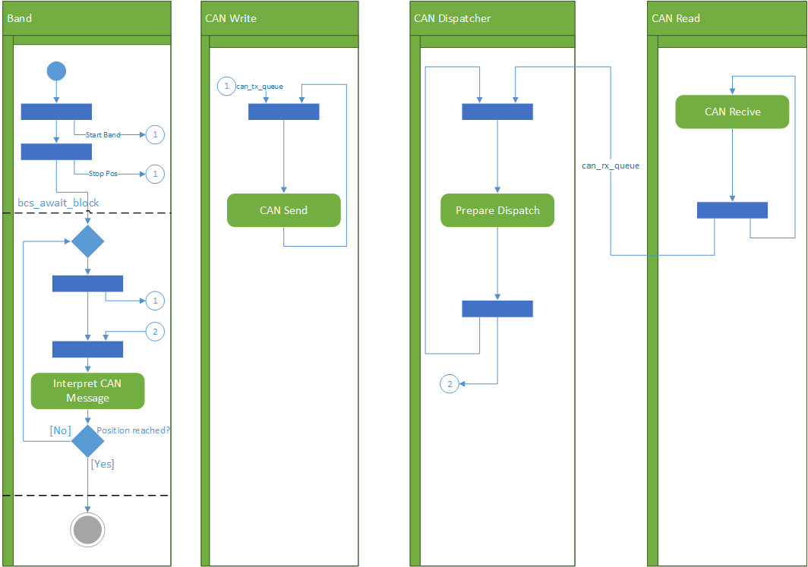

# Documentation

## Configuration

There are mainly two configuration values:

* One is in the file `bcs.c`, the define `MAX_BLOCK_COUNT`. Set this to the number of blocks you want to work with (between 2 and 4).
* The other configuration can happen at runtime. Use the DIP Switch 1, to switch between manaual and automatic direction choosing (for the dispatcher). Use the DIP Switch 2, to select the direction (left or right) in manual mode.

## General Idea

## File & Module & Task Description

| Module | Files  | Tasks | Description |
| ------|----- | ------- |---- |
| ucan | ucan.c, ucan.h | `CAN_Write_Task`, `CAN_Read_Task`, `CAN_Dispatch_Task` | Provides utilities to send and receive data from the CAN-Bus. Sending is done by calling the function `ucan_send_data`. To receive data, the modules can register themself using `ucan_link_message_to_queue`. |
| display | diplay.c, display.h | `Display Task` | Utilites to log stuff on the display. The function `display_log` can be used like printf (vargs!) and either logs your message to a new line in the log (together with the task name) or changes an existing line in the (scrolling) log. |
| arm | arm.c, arm.h | `Arm Left`, `Arm Right`, `Manual Arm Movement`  | Controls the robot arms. The positions are stored in two fixed arrays. To manually move the arm (using the buttons and switches) the task `Manual Arm Movement`  can be uncommented. |
| bcs | bcs.c, bcs.h | `mid`, `left`, `right` | Controls the belt conveyer system and the dispatcher. Provides a set of functions which are used by the arm tasks for synchronization. |
| main | main.c | *none* | Calls the init function of all modules (which spawns the tasks) |

## Sequence Visualization

The following picture shows the situation where the block is (always) moved right. If both arms are active, the situation is similar. In Step 7 and Step 10 the mutex for the critial air zone is taken/released, to ensure a safe operation. 

The table below describes what functions are called in the steps. Check the activity/tasks diagramms below, to find out which semaphores/queues are used inside the functions.

| Step Nr | Task  | When | What |
| ------|----- | -------|---- |
| 1 | mid belt | Before moving the block | `bcs_await_drop(belt_mid)`  |
| 2 | mid belt | Before dispatching the block to the right band | `bcs_prepare_drop(belt_right)`  |
| 3 | mid belt| After dispatching the block to the right band | `bcs_signal_dropped(belt_right)` `bcs_signal_band_free(belt_mid)` |
| 4 | right belt | Before moving the block |  `bcs_await_drop(belt_right)`  |
| 5 | right belt | When the block is ready for pickup |  `bcs_prepare_pickup(belt_right)`  |
| 6 | right arm | Before pickup |  `bcs_grab(belt_right)` `bcs_signal_band_free(belt_right)`  |
| 7 | right arm | Before entering critial air zone|  `arm_enter_critical_air_space()`  |
| 8 | right arm | Before dropping block onto belt |  `bcs_prepare_drop(belt_mid)`  |
| 9 | right arm | After dropping block onto belt |  `bcs_signal_dropped(belt_mid)`  |
| 10 | right arm | After leaving the critical air zone |  `arm_leave_critical_air_space()`  |

## Activity Diagramm

Activity Diagram for the Situation where the block is moved right. The CAN communication is not shown in this diagram. The Focus lies on the communication between the arm/belt tasks.

The following Activity Diagramm shows the detailed process of the "Move Block" sequence. In this diagramm the focus lies on the CAN communication. The other action like "Reset Dispatcher", "Dispatch" etc, wore in a similar way: They write stuff on the CAN-Bus by using a utility function that fills a queue. And they await a response to be put in their queue, by the CAN dispatcher task.

## Task Diagramms
In the following you find the tasks diagramms. These diagramms show all tasks and the commonly used resources (semaphores & mutexes).

### Conveyer System and Belt Tasks

### CAN Task

### Display Task
