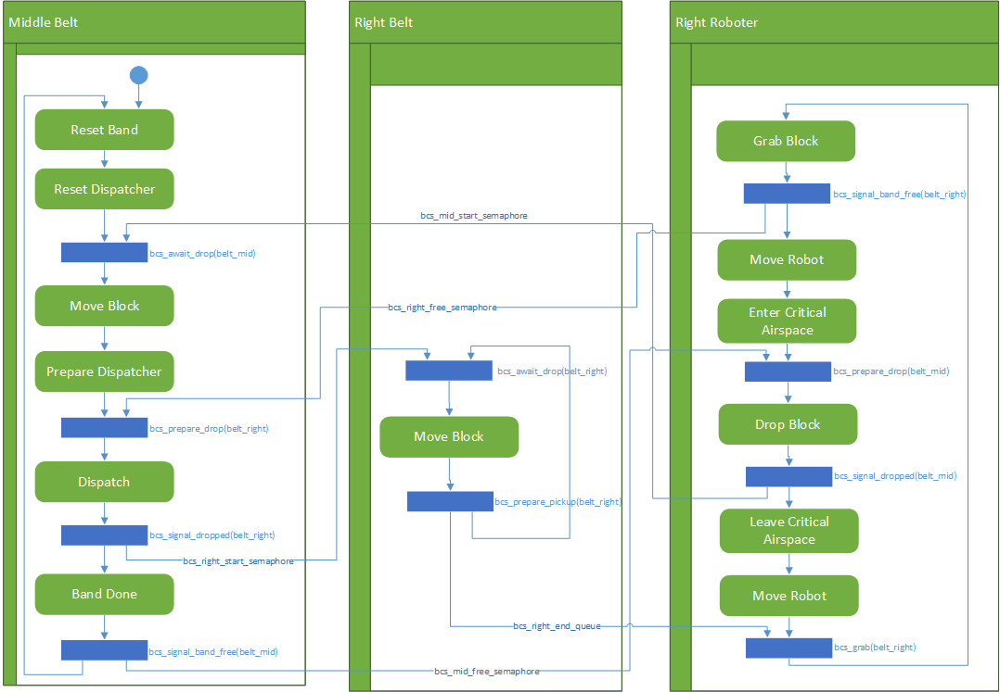

# Documentation

## Sequence Visualization

| Step Nr | Task  | When | What |
| ------|----- | -------|---- |
| 1 | mid belt | Before moving the block | `bcs_await_drop(belt_mid)`  |
| 2 | mid belt | Before dispatching the block to the right band | `bcs_prepare_drop(belt_right)`  |
| 3 | mid belt| After dispatching the block to the right band | `bcs_signal_dropped(belt_right)` `bcs_signal_band_free(belt_mid)` |
| 4 | right belt | Before moving the block |  `bcs_await_drop(belt_right)`  |
| 5 | right belt | When the block is ready for pickup |  `bcs_prepare_pickup(belt_right)`  |
| 6 | right arm | Before pickup |  `bcs_grab(belt_right)` `bcs_signal_band_free(belt_right)`  |
| 7 | right arm | Before entering critial air zone|  `arm_enter_critical_air_space()`  |
| 8 | right arm | Before dropping block onto belt |  `bcs_prepare_drop(belt_mid)`  |
| 9 | right arm | After dropping block onto belt |  `bcs_signal_dropped(belt_mid)`  |
| 10 | right arm | After leaving the critical air zone |  `arm_leave_critical_air_space()`  |

## Activity Diagramm

## Task Diagramms

### Conveyer System and Belt Tasks

### CAN Task

### Display Task
